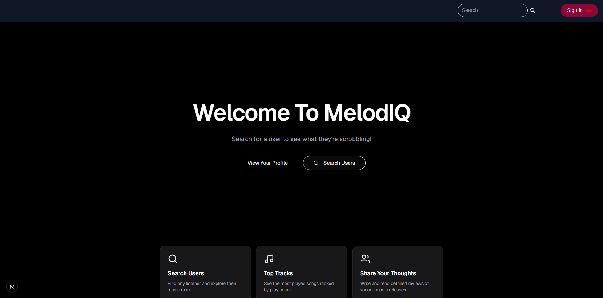
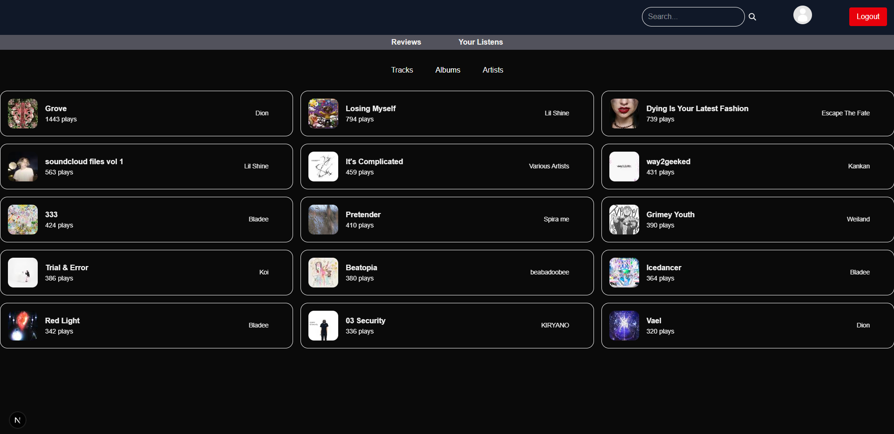

# MelodIQ

Search for listeners, view their listening habits, and leave reviews of your favourite tracks and albums!

---

## Screenshots

### Modern & Responsive UI


### Visualise Your Listening Habits


## Features

### Search Users

Find any Last.fm user and explore their listening activity.

### Top Tracks, Albums, and Artists

View a user's most played music ranked by play count.

### User Profiles

Each profile displays curated listening statistics including:

* Top tracks
* Top albums
* Top artists

### Review Your Favourite Music

Post, view, and interact with detailed review's on any music release.

---

## Tech Stack

**Framework**

* Next.js (App Router)

**Language**

* TypeScript

**Styling**

* Tailwind CSS

**Database / ORM**

* Prisma

**Icons**

* Lucide React

**APIs**

* Last.fm API

---

## Installation

Clone the repository:

```bash
git clone https://github.com/mjmck/melodIQ.git
cd melodIQ
```

Install dependencies:

```bash
npm install
```

Create a `.env` file:

```env
DATABASE_URL=your_database_url
API_SECRET=your_lastfm_api_secret
API_KEY=your_lastfm_api_key
```

Run the development server:

```bash
npm run dev
```

The app will be available at:

```
http://localhost:3000
```
---

## Author

Created as a personal project exploring modern full-stack development with Next.js and music data analysis.

